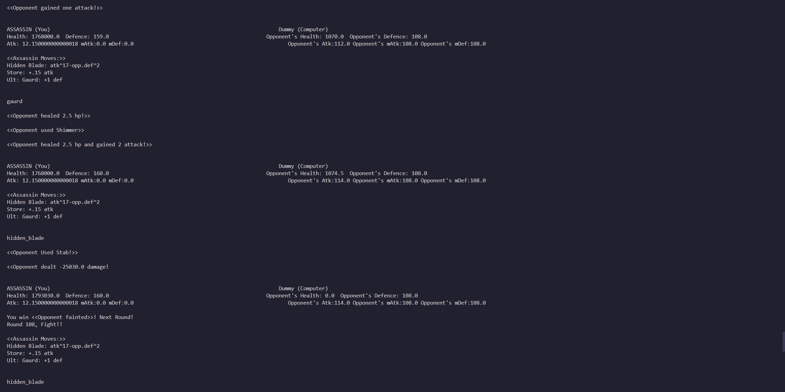

# TalesOfJim
Command-line Java RPG / Fighting Pokemon-Style Game

Efficient code? What's that??

This text-based adventure pits players against each other or AI opponents in strategic combat. With three modes - 1 player, 2 player, and training - and a variety of classes and moves, prepare yourself for hours of thrilling gameplay.

## Features

### Modes

1. **1 Player Mode**: Engage in intense battles against AI opponents. Test your skills and strategies against different AI-controlled characters.
   
2. **2 Player Mode**: Challenge a friend locally and engage in head-to-head combat. Prove your superiority in tactical combat.

3. **Training Mode**: Hone your skills in a simulated environment. Face off against enemies with ever-increasing stats and diverse move sets. Perfect for mastering different classes and strategies.

### Classes

1. **Cyborg**: Utilizes advanced technology for devastating attacks.
   
2. **Knight**: A master of defense and offense, wielding heavy armor and weapons.
   
3. **Archer**: Strikes from a distance with precision and agility.
   
4. **Healer**: Supports yourself with healing abilities and defensive spells.
   
5. **Assassin**: Strikes swiftly and silently, dealing massive damage.
   
6. **Shieldsman**: Shields yourself and absorbs damage, providing crucial defense.
   
7. **Warrior**: A versatile fighter skilled in various combat techniques.
   
8. **Swordsman**: Masters the art of swordplay, delivering lethal strikes with finesse.

### Moves

Each class comes with a unique set of moves, allowing for diverse gameplay and strategic depth. Experiment with different combinations to discover powerful synergies and tactics.

## Getting Started

1. **Clone the Repository**: Clone this repository to your local machine.

   ```bash
   git clone https://github.com/your-username/java-cli-rpg.git

- Compile the Code: Compile the Java files to create the executable.
javac Jim.java

- Run the Game: Execute the compiled file to start the game.
java Jim

- Choose Your Mode: Select the desired mode (1 player, 2 player, or training) and begin your adventure!



## Contributing

Contributions are welcome! If you have any suggestions, bug fixes, or new features to add, feel free to fork the repository and submit a pull request.

1. Fork the repository.
2. Create your feature branch (`git checkout -b feature/new-feature`).
3. Commit your changes (`git commit -am 'Add new feature'`).
4. Push to the branch (`git push origin feature/new-feature`).
5. Create a new Pull Request.

## License

This project is licensed under the [MIT License](LICENSE).
